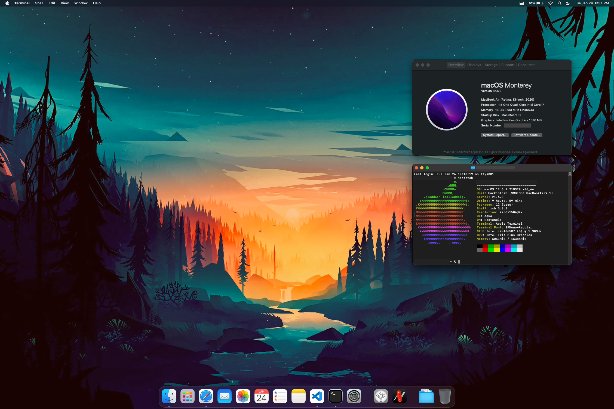

# Surface Air 3

This is a log of my Monterey 12.6.2 install on the Surface Laptop 3 using OpenCore 0.8.8. I call it the Surface Air 3 because it looks like an MacBook Air, sort of.

Please note this is <b>NOT</b> a guide!

If you want to create your own hackinotosh with this laptop, you'll need to read the [OpenCore guide](https://dortania.github.io/OpenCore-Install-Guide/). I mean it, you **will** need to read that guide to get a working computer.

With this readme, I just wanted to share my install log and experiences, and also serves as a reference for myself, should I ever need it in the future. I guess in a way it looks like a guide, but I'm not qualified to make one. I just followed the instructions without fully understanding what is going on. So, read the OC guide. Seriously.

## Preface

When I finally got it all installed and set up, it felt unreal seeing macOS run on non-Apple hardware, especially on a Microsoft product. I wasn't able to reach 100% feature parity to a real Mac (spoiler alert), but I've seen (Reddit) posts that have. Having the ability to do that is wonderful. So, thank you to all the devs that made this possible!

## Device

### Hardware

| Component | Details |
| -- | -- |
| CPU | i7-1065G7 |
| RAM | 16GB |
| GPU | Iris Plus Graphics G7 |
| Storage | KBG40ZNS1T02 |
| Audio | ALC274 |
| Screen | Sharp LQ135P1JX51   0x4D10 (Vendor ID)   0x14B3 (Product ID)

### Firmware

| | Version |
| -- | -- |
| SAM (Surface Aggregator Module) Controller | 14.602.139 | 
| Keyboard Controller | 14.204.139 |
| Touch Firmware | 3.0.213.139 |
| Tcon Firmware | 160.35.13.0 |
| PD Controller | 3.6.1 |
| Intel Type-C Retimer | 0.42.0.0 |
| System UEFI | 15.11.140 |
| Intem Management Engine | 130.0.2101.2 |

With this UEFI version, there was no TPM switch.

## Features

### Working

| Feature | Notes |
| -- | -- |
| Display | No way to turn on the screen again once the backlight is set to 0 without restarting |
| Keyboard | No issues, even all fn keys work! |
| Trackpad | Occasionally skips   Palm rejection is only ok, slightly annoying at times when the cursor jumps around while typing |
| Sleep | Maybe works?, battery drain could be improved (67% to 0% within 9 hours)   Wake up takes a few seconds |
| Speakers | Noticable hiss when waking up from sleep, goes away once any sound is played | 
| WiFi | No issues |
| Battery | No issues, but battery life is rather poor (I estimate around 3-4 hours) |

The trackpad has force touch on by default; disable that to have a working click.

The wakeup from sleep is noticeablebly slower than Windows. My old laptop that had S3 sleep woke up faster. This laptop with S0 modern standby (which is garbage and not really sleep anyway) "wakes up" much faster.

Battery life being 3-4 hours while only using it lightly and at screen brightness at 60-70% kinda sucks; I'm pretty sure Windows lasted longer.

### Partially tested

| Feature | Notes |
| -- | -- |
| Bluetooth | Works with earbuds, haven't tried keyboard, mouse, etc. |
| Camera | Works in FaceTime, haven't tried Zoom, Teams, Discord, etc. |
| Microphone | Works in Voice Memos, haven't tried Zoom, Teams, Discord, etc. |

### Untested

| Features | Notes |
| -- | -- |
| iServices | Theoretically works, haven't tried |
| Audio jack | Theoretically works, haven't tried |
| Display out via USB hub | Don't have a USB hub |
| Display out via Surface dock | Don't have the Surface dock, but should work b/c of BigSurface |

### Not working

| Feature | Notes |
| -- | -- |
| Touchscreen | Should be working b/c of BigSurface |

I don't cared about the touchscreen so I never bothered to look into why.

## Files

These are the files I used.

### ACPI

I started out with the Ice Lake files based on the OC guide.

* SSDT-EC-USBX-LAPTOP
* SSDT-PLUG
* SSDT-PNLF
* SSDT-RHUB
* SSDT-SURFACE

I created my own SSDT-PLUG using [SSDTTime](https://github.com/corpnewt/SSDTTime).

I removed SSDT-AWAC and SSDT-XOSI because I think SSDT-SURFACE covers those.

### Drivers

| Driver | Reason |
| -- | -- |
| HfsPlus | *Required* |
| OpenCanopy | Nice looking boot picker |
| OpenRuntime | *Required* |
| ResetNvramEntry | For convenience |

### Kexts

USBMap was dumped with [USBToolBox](https://github.com/USBToolBox/tool) 0.1.1. Other than the kexts specified by OpenCore, I added kexts for WiFi, keyboard, touchpad, and USB mapping when installing.

| Kext | Version | Reason |
| -- | -- | -- |
| AirportItlwm | 2.1.0 (Monterey ver.) | WiFi |
| AppleALC | 1.7.8 | Audio |
| BigSurface | 6.3 | Trackpad   Keyboard   Touchscreen   Camera   Microphone   Battery |
| BlueToolFixup | 2.6.4 (BrcmPatchRAM) | Bluetooth |
| IntelBluetoothFirmware | 2.2.0 (IntelBluetooth) | Bluetooth |
| Lilu | 1.6.3 | *Required* | 
| NVMeFIX | 1.1.0 | NVMe power mangement |
| RestrictEvents | 1.0.9 | Blocking processes |
| SMCProcessor | 1.3.0 (VirtualSMC) | Monitor CPU temps |
| SMCSuperIO | 1.3.0 (VirtualSMC) | Monitor fan speed |
| USBMap | - | USB |
| VirtualSMC | 1.3.0 | *Required* | 
| WhateverGreen | 1.6.3 | *Required* |

### config.plist

I changed a few things to make this laptop work better (I think).

#### ACPI

I removed entire part for XOSI `Change _OSI to XOSI` since it didn't seem to do anything. I think BigSurface handled trackpad wake up.

#### DeviceProperties

##### Add->PciRoot(0x0)/Pci(0x2,0x0)

| Key | Value |
| -- | -- |
| `AAPL,ig-platform-id` | `<0000528A>` |
| `enable-backlight-registers-fix` | `<01000000>` |
| `enable-backlight-smoother` | `<01000000>` |
| `enable-cdclk-frequency-fix` | `<01000000>` |
| `enable-dbuf-early-optimizer` | `<01000000>` |
| `enable-dvmt-calc-fix` | `<01000000>` |
| `framebuffer-patch-enable` | `<01000000>` |
| `framebuffer-stolenmem` | `<00003001>` |
| `framebuffer-fbmem` | `<00009000>` |

Key `AAPL,ig-platform-id` was set to the value the recommended on the patching guide. Not entire sure how to pick the best one.

Key `enable-backlight-registers-fix` or flag `-igfxblr` made the screen not so dim.

Key `enable-backlight-smoother` or flag `-igfxbls` made the backlight transition smoother.

Key `enable-cdclk-frequency-fix` or flag `-igfxcdc`, with keys `framebuffer-patch-enable`, `framebuffer-stolenmem`, and `framebuffer-fbmem` were added to make my mouse cursor show up. On 1st successful boot, I thought my trackpad wasn't working when it's actually this mouse not displaying properly. Sometimes on boot the screen, would also glitch, though not sure why.

Keys `enable-dbuf-early-optimizer` and `enable-dvmt-calc-fix` or boot flags `-igfxdbeo` and `-igfxdvmt`, respectively, are supposed to prevent kernel panics for Ice Lake iGPUs. I've had these flags / keys since the beginning so I don't know if they're necessary.

Details for all of the above graphics related properties can be found in the [WhateverGreen repository](https://github.com/acidanthera/WhateverGreen).

##### Add->PciRoot(0x0)/Pci(0x1F,0x3)

| Key | Value |
| -- | -- |
| `layout-id` | `35` |

I eventually settled on `-alcid` layout 35 after trying the other values. After a few reboots, a few times this value started working without any hissing. There might be a better layout but I don't know how to test.

The other layout IDs can be found on the [AppleALC wiki page](https://github.com/acidanthera/AppleALC/wiki/Supported-codecs).

#### PlatformInfo

| Key | Value |
| -- | -- |
| `Generic->SystemProductName` | `MacBookAir9,1` |

I chose the `MacBookAir9,1` SMBIOS since the CPU looked similar. The Air's CPU can be i7-1060NG7, which is slightly less powerful compared to the i7-1065G7.

When using this SMBIOS, it does feel like the Intel Airs that people describe. It's really quiet but does get quite warm sometimes.

#### Misc

| Key | Value |
| -- | -- |
| `Security->SecureBootModel` | `j230k` |

This is the value for MacBookAir19,1. Appears to allow use of Apple's Secure Boot. For more details on what this does see the [OpenCore Post-Install guide](https://dortania.github.io/OpenCore-Post-Install/universal/security/applesecureboot.html#what-is-apple-secure-boot).

## Postface

Getting OpenCore to boot and install macOS was fairly straightforward in my experience; I just needed to do my research beforehand and double check my work. OpenCore's documentation is *incredible*. The main difficulty was making sure features were working correctly afterwards. (Also don't screw up like I did and format the drive improperly so the EFI partition was missing, lol.) It "only" took a couple of hours a day for a week to get to this point.

That said, I'm done with this project, despite there still being things that should be fixed. I'll probably reinstall Windows or look for a nice Linux distro instead of continuing to refine this hack. Or maybe I give in and shell out for a real MacBook (rip wallet :')). 

The main reasons I stopped are sleep, battery life, and reliability. It takes too long to wake from sleep and the battery drains too fast for me (especially during sleep). In terms of reliability, I always felt like there was a degree of uncertainty on whether things would always work. One time, I was messing with screensavers, and part of the computer froze. I also habitually check the battery % and activity monitor to see if things are working like normal. Minor nitpick, but I couldn't get the scaling to work exactly how I'd like it to. I know these can be improved with tweaking, but I'd rather not spend that time.

To be honest, I'd agree with the people who recommend a legitimate MacBook over a hackintosh; it isn't worth it (at least for this laptop). The whole package is *really* hard to beat, despite the (imo) obscene price. Still a fun experience though!

### Note to the reader

If you've made it this far, don't feel discouraged when I say *I* wouldn't daily drive this. If you want to go for it, I'd honestly still recommend it, even if you end up only learning about the boot process.

Good luck!
